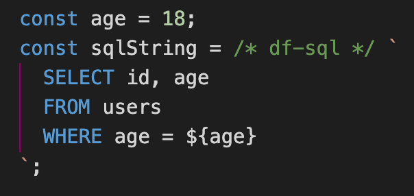

# Dataform flavored SQL VSCode extension

## Overview

<!-- TODO: Add extension links -->

This is a VSCode extension that provides syntax highlighting for Dataform-flavored SQL written inside JavaScript and TypeScript template literal tags.

<!-- TODO: Fix image links -->


## Usage

When you write code like the following in JavaScript or TypeScript, the SQL inside the template literal tag will be syntax highlighted:

```js
const sqlString = /* df-sql */ `
  SELECT *
  FROM ${ref('my_schema', 'my_table')}
`;
```

The SQL inside the template literal tag is assigned the language ID `df-sql`, and syntax highlighting similar to [ashish10alex/vscode-dataform-tools](https://github.com/ashish10alex/vscode-dataform-tools) is applied.

## Thanks

- [ashish10alex/vscode-dataform-tools](https://github.com/ashish10alex/vscode-dataform-tools)
- [mjbvz/vscode-comment-tagged-templates](https://github.com/mjbvz/vscode-comment-tagged-templates)
